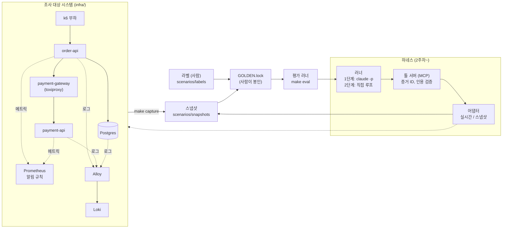

# 온콜 장애 분석 에이전트

장애 알림이 오면 로그·메트릭·배포 이력을 **읽기 전용 툴**로 조사하고, **근거가 검증된** 원인 리포트를 내는 에이전트를 만드는 프로젝트입니다.

목적은 에이전트 자체보다 **에이전트 하네스**(툴, 컨텍스트 관리, 가드레일, 평가, 관측성, 루프)를 직접 설계하고, 그 효과를 **숫자로 증명**하는 경험입니다.

> 진행 상태: 1단계 1주차 완료 (대상 시스템, 장애 시나리오 5종, 평가 데이터). 에이전트는 2주차부터 만듭니다.

---

## 핵심 아이디어: 에이전트보다 평가를 먼저

LLM은 같은 입력에도 매번 다르게 답하므로, 한두 번 잘 되는 것으로는 성능을 말할 수 없습니다. 프롬프트나 툴을 바꿨을 때 정말 나아졌는지도 숫자로 비교해야 합니다. 그래서 **정답이 있는 시험**을 먼저 만들었습니다.

| 시험에 비유하면 | 이 프로젝트에서 | 상태 |
|---|---|---|
| 시험 범위가 되는 세상 | 샘플 쇼핑몰 서비스 (order-api, payment-api, Postgres) | ✅ |
| 문제 출제 | 원인을 알고 있는 장애 5종을 직접 주입 | ✅ |
| 시험지 | 장애 순간의 알림·로그·메트릭·배포 이력 (스냅샷) | ✅ |
| 정답지 | 원인·핵심 근거·미끼를 적은 라벨 (사람이 확정) | ✅ |
| 봉인 | GOLDEN.lock (시험지·정답지의 해시, 바뀌면 평가 거부) | ✅ |
| 수험생 | 에이전트 | 2주차~ |
| 채점 | 평가 러너: 원인 일치, 근거 적중, 인용 유효율, 비용, 지연 | 3주차~ |

에이전트가 정말 필요한지도 확인합니다. 조회 순서를 코드로 고정하고 모델을 한 번만 부르는 **고정 파이프라인을 베이스라인**으로 두고 같은 시험으로 비교합니다.

---

## 아키텍처



- **정보 경계**: 에이전트는 현실의 당직자가 볼 수 있는 것(로그, 메트릭, 배포 이력, 알림)만 봅니다. 부하 생성기와 장애 주입 장치(toxiproxy)의 로그는 수집하지 않고, 주입 장치에는 중립적인 이름(`payment-gateway`)을 붙였습니다.
- **두 단계**: 1단계는 Claude Code를 에이전트 런타임으로 쓰고(`claude -p`), 2단계에서 API로 루프를 직접 만들어 같은 평가로 비교합니다. 두 러너는 같은 결과 형식(RunResult)을 따릅니다.
- **읽기 전용**: 에이전트 툴은 모두 읽기 전용입니다. 피해 범위를 "잘못된 리포트"로 한정합니다.

자세한 구조와 설계 결정 기록은 [docs/ARCHITECTURE.md](docs/ARCHITECTURE.md)에 있습니다.

---

## 장애 시나리오

| 시나리오 | 원인 | 주입 방법 | 알림 (주입 후) | 평가 포인트 |
|---|---|---|---|---|
| bad-deploy-01 | 잘못된 배포 | null 처리가 빠진 버전 배포 | 에러율 (88초) | 기준점. 배포 직후 NPE |
| pool-exhaustion-01 | 커넥션 풀 고갈 | 결제 호출을 트랜잭션 안으로 옮긴 버전 배포 | 에러율 (103초) | 풀 크기 증설은 임시방편 |
| slow-query-01 | 느린 쿼리 | 인덱스 삭제 | 지연 (131초) | 풀 고갈이 **증상**으로 함께 나타남. 무관한 배포(미끼)도 있음 |
| downstream-timeout-01 | 하위 서비스 타임아웃 | 서비스 사이 구간에 지연 5초 | 에러율 (80초) | 하위 서비스 자체는 정상. 미끼 배포 |
| memory-leak-01 | 메모리 누수 | 만료 없는 캐시가 있는 버전 배포 | 힙 사용률 (499초) | 로그 흔적이 거의 없어 메트릭으로 추론 |

시나리오 정의, 라벨, 스냅샷 형식은 [docs/SCENARIO_FORMAT.md](docs/SCENARIO_FORMAT.md)에 있습니다.

---

## 평가 무결성

점수를 올리려고 정답이나 시험지를 바꾸는 일을 막는 장치를 여러 겹으로 두었습니다.

- **GOLDEN.lock**: 라벨과 스냅샷 파일의 SHA-256. 평가는 시작할 때 검증하고, 1바이트라도 다르면 실행을 거부합니다.
- **사람만 하는 일**: 라벨 확정과 봉인 갱신(`make lock-golden`). AI 개발 도우미의 편집·명령 권한으로도 막아 두었습니다.
- **누출 검사**: 스냅샷에 장애 주입 흔적(정답 힌트)이 있으면 스냅샷을 만들지 않습니다.
- **재현성**: 시드 고정 데이터, 일정한 부하, 시나리오에서 계산되는 배포 ID, 바이트 단위로 고정된 출력(LF, 키 순서).
- **채점 기준 변경은 별도 커밋**으로 이유와 함께 남깁니다.

---

## 기술 스택

| 영역 | 기술 | 고른 이유 |
|---|---|---|
| 하네스·평가 | Java 21, Gradle(Kotlin DSL) 멀티모듈, JUnit 5 | 모듈 경계로 설계 원칙을 빌드에서 강제 (예: 모델 SDK는 게이트웨이 모듈만 의존) |
| 조사 대상 서비스 | Spring Boot 4.1, HikariCP, Micrometer, Postgres 17 | 실무와 같은 로그·메트릭 흔적. 하네스와는 별도 빌드 |
| 관측 | Prometheus, Loki, Grafana Alloy | 메트릭·로그를 같은 라벨 모델로 수집. 알림 규칙 판정 |
| 장애·부하 | toxiproxy, k6 | 앱 코드 수정 없이 네트워크 장애 주입, 일정한 초당 요청 |
| 실행 환경 | Docker Compose, GNU make | `make up` 한 번으로 전체 시스템 기동 |
| 데이터 처리 | Jackson 3 | 시나리오 정의(YAML)와 API 응답(JSON) 처리 |
| 에이전트 (예정) | Claude Code(`claude -p`) → 2단계 Anthropic SDK, MCP | 1단계는 런타임 위에서 하네스를, 2단계는 루프를 직접 |

---

## 디렉터리

```
eval/              평가: GOLDEN.lock 검증, 캡처 도구(make capture), 채점(예정)
scenarios/
  definitions/     장애 주입 정의 (선언형 단계: deploy, sql, toxic, wait)
  snapshots/       캡처된 시험지 (스크립트만 생성)
  labels/          정답지 (사람만 수정)
  GOLDEN.lock      봉인
infra/             docker-compose, 샘플 서비스(services/), 관측 스택 설정
docs/              설계, 로드맵, 시나리오 형식
tools/ adapters/ runners/ service/   2주차 이후
```

---

## 실행하기

**준비물**: Docker Desktop, JDK 17 이상(빌드는 Gradle이 JDK 21을 자동으로 받음), GNU make

```bash
make up          # 대상 시스템 기동 (첫 실행은 이미지 빌드와 주문 400만 건 시드로 몇 분)
make test        # 단위 테스트 (모델 호출 없음)
make eval        # GOLDEN.lock 검증 (채점은 3주차)
make capture SCENARIO=bad-deploy-01   # 장애 주입 후 스냅샷 캡처 (기존 스냅샷은 덮어쓰지 않음)
make down        # 종료 (데이터 유지) / make down-clean: 데이터까지 삭제
```

사람이 눈으로 볼 때는 Grafana를 켤 수 있습니다: `docker compose -f infra/docker-compose.yml --profile ui up -d` → http://localhost:3000

---

## 문서

- [docs/ARCHITECTURE.md](docs/ARCHITECTURE.md): 구조, 러너 인터페이스, 설계 결정 기록
- [docs/ROADMAP.md](docs/ROADMAP.md): 단계·주차별 범위와 완료 기준
- [docs/SCENARIO_FORMAT.md](docs/SCENARIO_FORMAT.md): 시나리오 정의, 라벨, 스냅샷 형식
- [AGENTS.md](AGENTS.md): 이 저장소에서 작업하는 AI 개발 도우미를 위한 규칙 (설계 원칙, 평가 무결성)

## 개발 방식

AI 개발 도우미(Claude Code)와 함께 개발합니다. 보일러플레이트와 인프라는 AI에게 맡기고, **정답 라벨, 평가 지표, 툴 스키마, 인용 검증 규칙**은 사람이 설계하고 판정합니다. 핵심 설계 결정은 모두 [결정 기록](docs/ARCHITECTURE.md#결정-기록)에 이유와 대안을 함께 남깁니다.
