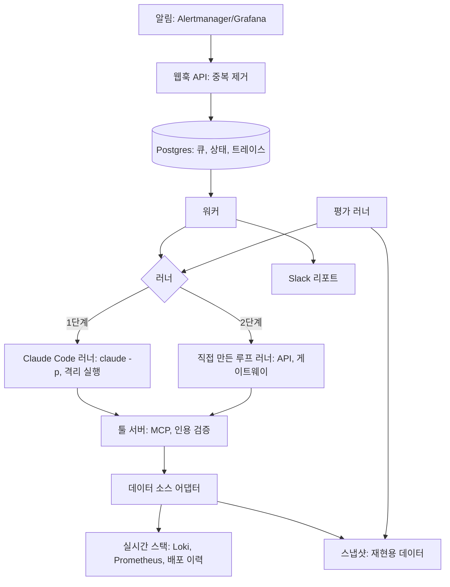

# 아키텍처



## 공통 부분과 러너별 부분
공통(두 단계에서 그대로 사용): 툴 서버(`tools/`), 데이터 소스 어댑터(`adapters/`), 평가 하네스(`eval/`), 서비스 레이어(`service/`), 시나리오, 프롬프트 파일.
러너별: 에이전트 루프를 누가 돌리는지, 컨텍스트를 어떻게 관리하는지, 비용을 어떻게 재는지.

| 관심사 | 1단계: Claude Code 러너 | 2단계: 직접 만든 루프 러너 |
|---|---|---|
| 루프·종료 조건 | Claude Code | 직접 구현 |
| 컨텍스트 관리 | Claude Code (우리는 툴 출력 설계로 영향) | 직접 구현 (압축, 가설 노트) |
| 툴 | 공통 MCP 서버 | 공통 |
| 가드레일 | 허용 툴 잠금, 권한 모드, 격리 실행, 툴 서버 검사 | 위 + 루프 레벨 검사 |
| 인용 검증 | 툴 서버 (공통) | 공통 |
| 비용 | 클라이언트 추정치 + 구독 한도 소모 | API 사용량 측정 |
| 트레이스 | stream-json 이벤트를 정규화 | 직접 기록 |

## 레이어
- 서비스 레이어: 웹훅 수신, 알림 중복 제거, Postgres 기반 큐, 워커, 실행 상태 저장, Slack 전송. 러너는 인터페이스 뒤에 숨는다
- 러너: 한 건의 조사를 실행해 RunResult를 반환한다
- 툴 서버: 읽기 전용 툴, evidence ID 발급·보관, `submit_report` 검증, 수락된 리포트 저장
- 데이터 소스 어댑터: 실시간 스택과 스냅샷을 같은 인터페이스로 제공
- 평가 하네스: 시나리오 주입, 스냅샷 생성·재생, N회 실행, 채점, 러너 간 비교

## 러너 인터페이스 (RunResult)
```json
{
  "run_id": "string",
  "runner": "claude_code | own_loop | baseline",
  "scenario_id": "string",
  "status": "succeeded | failed | timeout | budget_exceeded | report_rejected",
  "report": { "...": "리포트 스키마" },
  "trace": [
    { "step": 1, "type": "model | tool_call | tool_result | error", "name": "search_logs", "tokens": 0, "latency_ms": 0 }
  ],
  "usage": { "input_tokens": 0, "output_tokens": 0, "cost_usd": 0.0, "cost_source": "estimate | measured" },
  "latency_ms": 0
}
```
`report`는 툴 서버가 수락한 리포트만 담고, 없으면 null이다.
1단계의 비용은 `claude -p`가 알려주는 클라이언트 추정치라서 `cost_source: estimate`로 표시하고, 실제 구독 한도 소모는 별도로 기록한다. 2단계는 API 응답의 사용량으로 `measured`를 기록한다.

## 툴 (모두 읽기 전용, MCP 서버 이름: oncall)
| 툴 | 역할 |
|---|---|
| `search_logs` | 서비스·레벨·시간 범위로 조회. 패턴별 집계 + 샘플 + 상세 조회 ID 반환 |
| `get_log_lines` | 패턴 ID로 원문 일부를 페이지 단위로 조회 |
| `get_metrics` | 허용된 메트릭 이름과 시간 범위로 조회. 임의 쿼리는 받지 않음 |
| `get_recent_deploys` | 최근 배포 이력 |
| `get_diff` | 배포 ID의 변경 내용 요약 |
| `read_runbook` | prompts/runbooks의 문서 조회 |
| `submit_report` | 리포트 제출. 인용 검증 통과 시에만 수락 |

## 리포트 스키마
```json
{
  "root_cause_category": "bad_deploy",
  "summary": "한두 문장 요약",
  "confidence": "high | medium | low | unknown",
  "evidence": [{ "id": "E3", "quote": "툴 결과에 실제로 있는 발췌문" }],
  "recommended_actions": ["조치 제안"]
}
```

## 평가 지표
- 원인 카테고리 일치율, 핵심 근거 적중률
- 인용 유효율: 인용한 ID가 존재하고 발췌문이 원문과 일치하는 비율
- 미검증 인용률, 근거 없는 주장 비율(LLM 판정, 사람 라벨로 보정)
- 스텝 수, 토큰, 비용(추정/실측 구분), 지연
- 인젝션 공격 성공률 (방어 전후)
- 러너 비교: 같은 시나리오·같은 지표로 baseline, claude_code, own_loop를 나란히

## 보안 고려
- 로그에는 외부 입력이 섞인다. 간접 프롬프트 인젝션을 기본 위협으로 본다.
- 툴을 읽기 전용으로 제한해 피해 범위를 "잘못된 리포트"로 한정한다.
- 1단계 격리 실행: 빈 임시 작업 디렉터리, 개발용 지침·훅 미로드, 허용 툴은 `oncall` MCP 툴만. 내장 툴이 실제로 막혀 있는지 7주차에 테스트로 검증한다.
- 모델에 보내기 전에 민감정보를 마스킹한다.
- 리포트에서 외부 링크를 제거하거나 허용 목록으로 제한해 데이터 유출 경로를 줄인다.

## 결정 기록
형식: 날짜 | 결정 | 이유 | 대안

| 날짜 | 결정 | 이유 | 대안 |
|---|---|---|---|
| 초기 | 주제는 온콜 장애 분석 에이전트 | 백엔드 경력이 드러나고, 장애 주입으로 정답 있는 평가가 가능하며, 보안 경력과 이어짐 | CS 에이전트, 데이터 분석 에이전트 |
| 초기 | 에이전트 형태를 쓰되 고정 파이프라인 베이스라인과 비교 | 조사 경로가 앞 결과에 따라 갈려서 에이전트가 어울리지만, 숫자로 확인한다 | 워크플로우만 구현 |
| 초기 | 툴은 읽기 전용 | 피해 범위 제한 | 승인 후 실행 툴 (확장 항목) |
| 초기 | 평가는 스냅샷 재생 기반 | 같은 입력으로 반복 가능하고 저렴함 | 매번 실제 장애 주입 |
| 초기 | (v2에서 대체) 루프는 SDK 직접 구현 | 하네스 구조를 깊이 이해하기 위함 | 에이전트 프레임워크 |
| 초기 | (v2에서 대체) 모델 호출은 게이트웨이로 분리 | 공급자 교체와 사내 환경 대응 | SDK 직접 호출 |
| 초기 | (v2에서 대체) 인용 검증은 `submit_report` 툴 안에서 코드로 수행 | 어떤 런타임(자작 루프, Copilot)에서도 검증 유지 | 루프 쪽에서 검증 |
| 2026-10-05 | Java 21 + Gradle 멀티모듈. 하네스는 순수 Java, Spring Boot는 service에만 | 주력 스택이라 하네스 설계에 시간을 쓸 수 있음. 평가·서비스·MCP 어댑터가 같은 하네스를 스프링 기동 없이 공유 | Python 3.12 + uv (SDK·예제 풍부, 반복 빠름), TypeScript, Go |
| 2026-10-05 | 모듈 경계로 원칙 강제: SDK는 agent-gateway가 `implementation`으로만 의존 | 원칙 5 위반이 관례가 아니라 컴파일 에러가 됨 | 린트·코드 리뷰로 관리 |
| 2026-10-05 | 실행 환경은 Windows 네이티브 + GNU make. Makefile은 셸 문법에 기대지 않게 작성 | WSL2를 추천했으나 WSL 계정 문제로 보류. CI(Linux)와 개발 PC 양쪽에서 같은 Makefile이 돌아야 함 | WSL2 (make·.sh·docker가 그대로 동작) |
| 2026-10-05 | GOLDEN.lock은 sha256sum 호환 텍스트, 바이트 그대로 해시, 경로는 '/' 정규화. `scenarios/** -text` | diff로 읽히고 외부 도구로 재검증 가능. 줄바꿈 변환이 해시를 깨지 않게 함 | JSON lock, 디렉터리 단일 해시 |
| 2026-10-05 | lock 생성은 별도 태스크(`lockGolden`)로 분리하고 deny 규칙 대상에 포함 | `make lock-golden`만 막으면 gradlew로 우회 가능 | make 타깃만 차단 |
| 2026-10-06 | 샘플 서비스는 Spring Boot 2개(order-api, payment-api), `infra/services` 별도 Gradle 빌드, 이미지 안에서 컴파일 | HikariCP·Micrometer가 실제와 같은 로그·메트릭을 남김. 대상 시스템이라 하네스 빌드와 분리 | Go/Python 경량 서비스 |
| 2026-10-06 | 배포는 하나의 이미지에서 `APP_VERSION`을 바꿔 재기동하는 것으로 표현. 변경 설명은 `versions.yaml` | 버전별 이미지를 따로 만들지 않고도 배포 이력과 diff를 재현 가능 | 버전별 이미지 빌드 |
| 2026-10-06 | 로그 수집은 Alloy, 대상은 order-api·payment-api·postgres만 | Postgres 느린 쿼리 로그까지 수집. 부하 생성기·toxiproxy 로그는 주입 흔적이라 제외 | 앱 Loki appender, Promtail(지원 종료) |
| 2026-10-06 | 하위 서비스 지연은 toxiproxy로 주입 | 앱 코드에 장애 분기를 넣지 않아 로그에 주입 흔적이 남지 않음 | payment-api에 지연 플래그 |
| 2026-10-06 | 평소 노이즈(재고 동기화 지연 경고, 404, 미지 쿠폰)와 무관한 배포를 섞는다 | 노이즈가 없으면 "에러 로그 하나 찾기"가 되어 평가 변별력이 없음 | 노이즈 없는 깨끗한 로그 |
| v2 | 두 단계 구성: 1단계 Claude Code 런타임, 2단계 직접 루프 | 구조 이해를 먼저 하고, API 결제 결정을 미루며, 두 방식의 비교 기록을 남김 | 처음부터 직접 루프 |
| v2 | 러너 인터페이스(RunResult)를 처음부터 고정 | 2단계가 재작성이 아니라 러너 추가가 되도록 | 러너별 개별 형식 |
| v2 | 인용 검증과 리포트 저장은 툴 서버 안에서 | 어떤 런타임(Claude Code, 직접 루프, Copilot)에서도 검증 유지 | 러너가 모델 텍스트를 파싱 |
| v2 | 1단계 에이전트는 격리 실행 | 개발용 지침이 평가 대상에 섞이면 평가가 오염됨 | 저장소 루트에서 실행 |
| v2 | 모델 게이트웨이와 직접 루프는 2단계로 이동 | 1단계 런타임은 Claude Code가 호출을 관리함 | 1단계부터 구현 |
| v2 | CI는 모델 호출 없는 테스트만 | 구독 로그인을 CI에 쓰지 않고, 모델 평가는 로컬 실행 후 결과 커밋 | CI에서 모델 평가 |
| 2026-10-06 | Gradle 모듈을 v2 디렉터리에 맞춤 (tools, adapters, runners, eval, service). SDK 경계는 own_loop 게이트웨이로 이동 | v2 구조 반영 | v1 agent-* 모듈 |
| 2026-10-06 | 샘플 서비스 스택트레이스를 앱 설정으로 축약 (예외당 12프레임, 3000자, 공통 프레임 생략) | 장애 구간 로그가 분당 약 4MB라 스냅샷이 git에 너무 큼. 운영에서도 흔한 설정이고 원인(Caused by) 체인은 남음 | 스냅샷 gzip 압축, 캡처 후 가공(스냅샷 원본성 훼손) |
| 2026-10-06 | 연쇄 증상이 있는 시나리오의 라벨은 원인 기준. 예: slow_query는 풀 고갈 증상이 함께 나도 핵심 근거는 Postgres 느린 쿼리 로그와 배포 부재 | 증상만 보고 풀 크기를 늘리는 오답 조치를 걸러내는 것이 평가 목적 | 증상 카테고리도 정답으로 인정 |
| 2026-10-06 | memory_leak의 영수증 캐시 항목은 16KB 유지 (알림까지 약 9분) | 32KB로 줄이려 했으나 85% 도달 후 OOM까지 35초뿐이라 알림(for: 1m) 전에 재기동됨. 시간보다 재현 안정성 우선 | 32KB (불안정), 알림 for 단축(알림 의미 변경) |
| 2026-10-07 | capture는 eval 모듈(`dev.oncall.eval.capture`)에 둔다 | v2 디렉터리 표에 자리가 없고, 시나리오를 다루는 쪽이 eval | 별도 capture 모듈 |
| 2026-10-07 | 장애 주입은 선언형 steps(deploy, sql, toxic, wait)의 닫힌 집합. 모르는 키·단계는 거부 | 셸 문법에 의존하지 않고, AI도 고칠 수 있는 정의 파일로 임의 명령을 실행할 수 없게 함 | 셸 스크립트 |
| 2026-10-07 | 캡처 시각은 Prometheus 서버 시각(`time()`) 기준 | Windows 호스트와 Docker VM 시계 오차가 로그·메트릭 타임스탬프와 어긋나지 않게 | 호스트 시계 |
| 2026-10-07 | 기준선 복원은 배포 이력에 남기지 않고, 배포 이력의 과거 부분은 고정 합성, 배포 ID는 시나리오·단계 위치의 해시 | 복원은 환경 초기화일 뿐이고, 다시 캡처해도 라벨의 deploy_id가 유지되어야 함 | 실제 배포 레지스트리 기록 |
| 2026-10-07 | 누출 검사(LeakGuard): 주입 흔적 단어가 있으면 스냅샷을 만들지 않음. toxiproxy에는 중립 별칭 `payment-gateway`를 붙임 | 예외 메시지와 메트릭 라벨에 호스트 이름 toxiproxy가 찍혀 정답이 새는 것을 설계 중 발견 | 캡처 후 수동 검토 |
| 2026-10-07 | meta.json·정의·라벨은 평가 전용. 2주차 어댑터와 툴이 노출하지 않는다 | 주입 시각과 원인이 들어 있음 | - |
