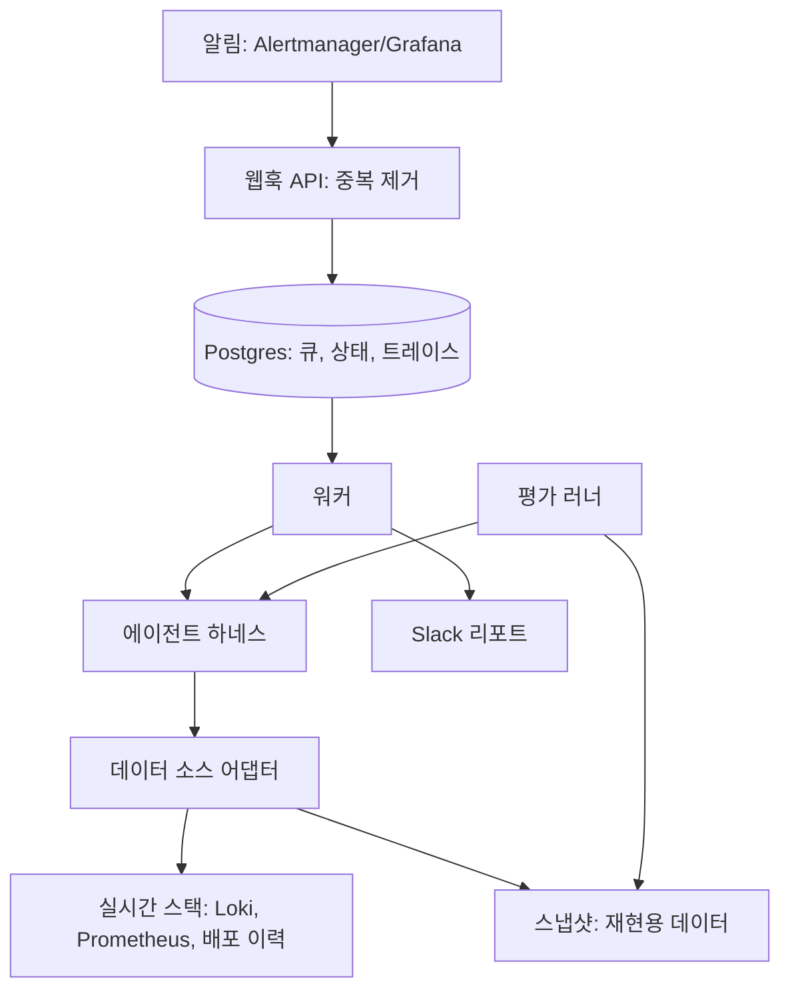

# 아키텍처



## 레이어
- 서비스 레이어: 웹훅 수신, 알림 중복 제거, Postgres 기반 큐, 워커, 실행 상태 저장, Slack 전송
- 에이전트 하네스: 루프, 컨텍스트 관리, 툴 레지스트리, 가드레일, 인용 검증기, 모델 게이트웨이, 트레이스 기록
- 데이터 소스 어댑터: 실시간 스택과 스냅샷을 같은 인터페이스로 제공
- 평가 하네스: 시나리오 주입, 스냅샷 생성·재생, N회 실행, 채점, 비교

## 툴 (모두 읽기 전용)
| 툴 | 역할 |
|---|---|
| `search_logs` | 서비스·레벨·시간 범위로 조회. 패턴별 집계 + 샘플 + 상세 조회 ID 반환 |
| `get_log_lines` | 패턴 ID로 원문 일부를 페이지 단위로 조회 |
| `get_metrics` | 허용된 메트릭 이름과 시간 범위로 조회. 임의 쿼리는 받지 않음 |
| `get_recent_deploys` | 최근 배포 이력 |
| `get_diff` | 배포 ID의 변경 내용 요약 |
| `read_runbook` | prompts/runbooks의 문서 조회 |
| `submit_report` | 리포트 제출. 인용 검증 통과 시에만 성공 |

## 리포트 스키마
```json
{
  "root_cause_category": "bad_deploy",
  "summary": "한두 문장 요약",
  "confidence": "high | medium | low | unknown",
  "evidence": [{ "id": "E3", "quote": "툴 결과에 실제로 있는 발췌문" }],
  "recommended_actions": ["조치 제안"]
}
```

## 평가 지표
- 원인 카테고리 일치율, 핵심 근거 적중률
- 인용 유효율: 인용한 ID가 존재하고 발췌문이 원문과 일치하는 비율
- 미검증 인용률, 근거 없는 주장 비율(LLM 판정, 사람 라벨로 보정)
- 스텝 수, 토큰, 건당 비용, 지연
- 인젝션 공격 성공률 (방어 전후)

## 보안 고려
- 로그에는 외부 입력이 섞인다. 간접 프롬프트 인젝션을 기본 위협으로 본다.
- 툴을 읽기 전용으로 제한해 피해 범위를 "잘못된 리포트"로 한정한다.
- 모델에 보내기 전에 민감정보를 마스킹한다.
- 리포트에서 외부 링크를 제거하거나 허용 목록으로 제한해 데이터 유출 경로를 줄인다.

## 결정 기록
형식: 날짜 | 결정 | 이유 | 대안

| 날짜 | 결정 | 이유 | 대안 |
|---|---|---|---|
| 초기 | 주제는 온콜 장애 분석 에이전트 | 백엔드 경력이 드러나고, 장애 주입으로 정답 있는 평가가 가능하며, 보안 경력과 이어짐 | CS 에이전트, 데이터 분석 에이전트 |
| 초기 | 에이전트 형태를 쓰되 고정 파이프라인 베이스라인과 비교 | 조사 경로가 앞 결과에 따라 갈려서 에이전트가 어울리지만, 숫자로 확인한다 | 워크플로우만 구현 |
| 초기 | 툴은 읽기 전용 | 피해 범위 제한 | 승인 후 실행 툴 (확장 항목) |
| 초기 | 평가는 스냅샷 재생 기반 | 같은 입력으로 반복 가능하고 저렴함 | 매번 실제 장애 주입 |
| 초기 | 루프는 SDK 직접 구현 | 하네스 구조를 깊이 이해하기 위함 | 에이전트 프레임워크 |
| 초기 | 모델 호출은 게이트웨이로 분리 | 공급자 교체와 사내 환경 대응 | SDK 직접 호출 |
| 초기 | 인용 검증은 `submit_report` 툴 안에서 코드로 수행 | 어떤 런타임(자작 루프, Copilot)에서도 검증 유지 | 루프 쪽에서 검증 |
| 2026-10-05 | Java 21 + Gradle 멀티모듈. 하네스는 순수 Java, Spring Boot는 service에만 | 주력 스택이라 하네스 설계에 시간을 쓸 수 있음. 평가·서비스·MCP 어댑터가 같은 하네스를 스프링 기동 없이 공유 | Python 3.12 + uv (SDK·예제 풍부, 반복 빠름), TypeScript, Go |
| 2026-10-05 | 모듈 경계로 원칙 강제: SDK는 agent-gateway가 `implementation`으로만 의존 | 원칙 5 위반이 관례가 아니라 컴파일 에러가 됨 | 린트·코드 리뷰로 관리 |
| 2026-10-05 | 실행 환경은 Windows 네이티브 + GNU make. Makefile은 셸 문법에 기대지 않게 작성 | WSL2를 추천했으나 WSL 계정 문제로 보류. CI(Linux)와 개발 PC 양쪽에서 같은 Makefile이 돌아야 함 | WSL2 (make·.sh·docker가 그대로 동작) |
| 2026-10-05 | GOLDEN.lock은 sha256sum 호환 텍스트, 바이트 그대로 해시, 경로는 '/' 정규화. `scenarios/** -text` | diff로 읽히고 외부 도구로 재검증 가능. 줄바꿈 변환이 해시를 깨지 않게 함 | JSON lock, 디렉터리 단일 해시 |
| 2026-10-05 | lock 생성은 별도 태스크(`lockGolden`)로 분리하고 deny 규칙 대상에 포함 | `make lock-golden`만 막으면 gradlew로 우회 가능 | make 타깃만 차단 |
